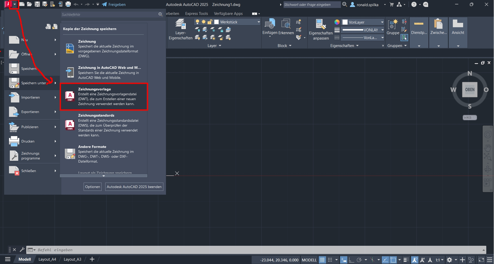
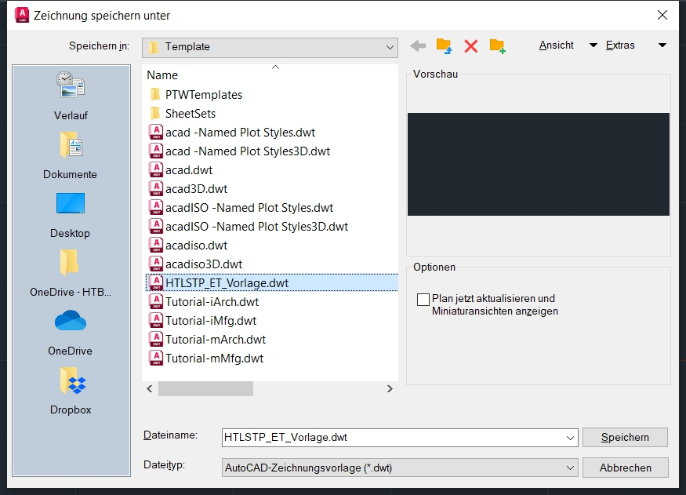
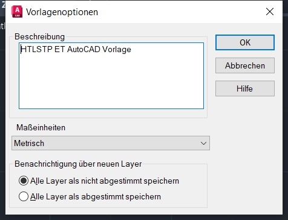
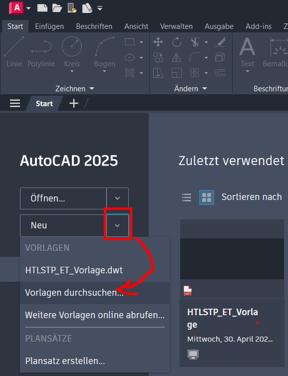
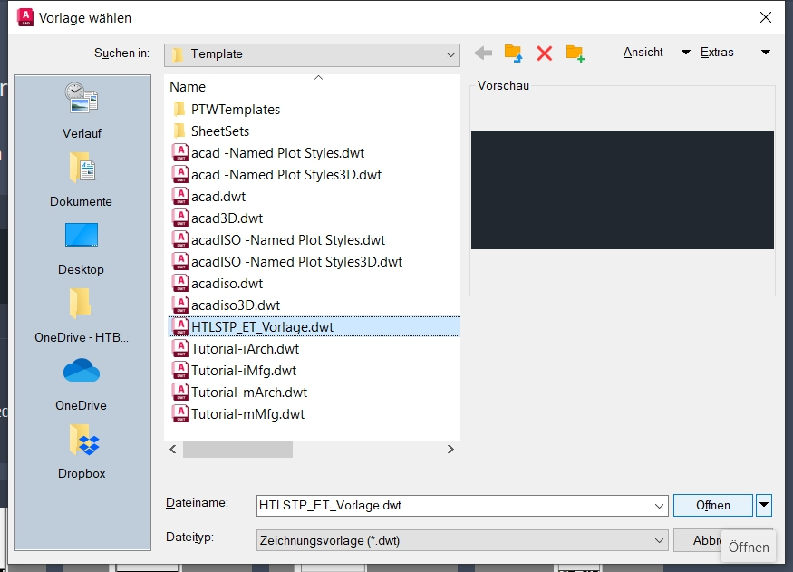

# Vorlage ET-HTLSTP für AutoCAD
## Übersicht
* [Download und Einbinden](#download-und-einbinden-der-autocad-vorlage)
* [Inhalt und Verwendung](#inhalt-und-verwendung-der-vorlage)

[zurück zur allgemeinen Autodesk-Wiki-Site](../index.md)

## Download und Einbinden der AutoCAD-Vorlage

Ein einfacher Weg die Vorlage als Standardvorlage in AutoCAD eintragen ist wie folgt (Screenshots zur Anleitung sind unter "screenshots" zu finden):
- Nachdem die [AutoCAD Vorlage](https://htlstp.sharepoint.com/:u:/r/sites/ET-EDV/ETDocs/Vorlagen/AutoCAD/HTLSTP_ET_Vorlage.dwt "download") <a href="https://htlstp.sharepoint.com/:u:/r/sites/ET-EDV/ETDocs/Vorlagen/AutoCAD/HTLSTP_ET_Vorlage.dwt" download>Vorlagendatei</a> (Dateiendung .dwt) heruntergeladen wurde, diese mit einem Doppelklick öffen. Sollte nicht die gewünschte AutoCAD-Version starten, diese über "Öffen mit..." auswählen.
- In AutoCAD "Speichern unter -> Zeichnungsvorlage" auswählen. Dadurch wird automatisch ein Verzeichnis geöffnet in welchem AutoCAD Vorlagen sucht.

  

- Nun noch einen sprechenden Namen z.B. HTLSTP_ET_Vorlage.dwt vergeben und mit einem Klick auf "Speichern" abschließen.

  

- Die Nachfrage zu den Vorlagenoptionen kann mit einem Klick auf "OK" geschlossen werden.

  

- Die noch geöffnete Vorlagendatei kann nun geschlossen werden.
- Beim Erstellen einer neuen Datei (zumindest bei der ersten Verwendung), muss auf den kleinen Pfeil neben "Neu" geklickt werden
  
  
  
- und die gewünschte Vorlagendatei z.B. HTLSTP_ET_Vorlage.dwt ausgewählt werden. Diesen Dialog mit einem Klick auf "Öffnen" beenden.
  
  

- Nun kann kann ganz Normal in AutoCAD gearbeitet und auf die vordefinierten Layer sowei die Layouts mit Schriftkopf zugegriffen werden.

## Inhalt und Verwendung der Vorlage
Die Vorlage enthält neben einigen vordefinierten Layern auch A3- und A4-Layouts mit einem ET-Schriftkopf.
Um den Schiftkopf auszufüllen, sind die entsprchenden Block-Attribute zu beschreiben. Einige Atrribute sind bereits mit Defaultwerten aus der dem Speicherort befüllt. Daher sollte bevor der Schriftkopf bearbeitet wird die Datei gespeichert werden. Einzelne Attribute können jedoch vom Benutzer nicht verändert werden (Urheber).

[zurück zur allgemeinen Autodesk-Wiki-Site](../index.md)