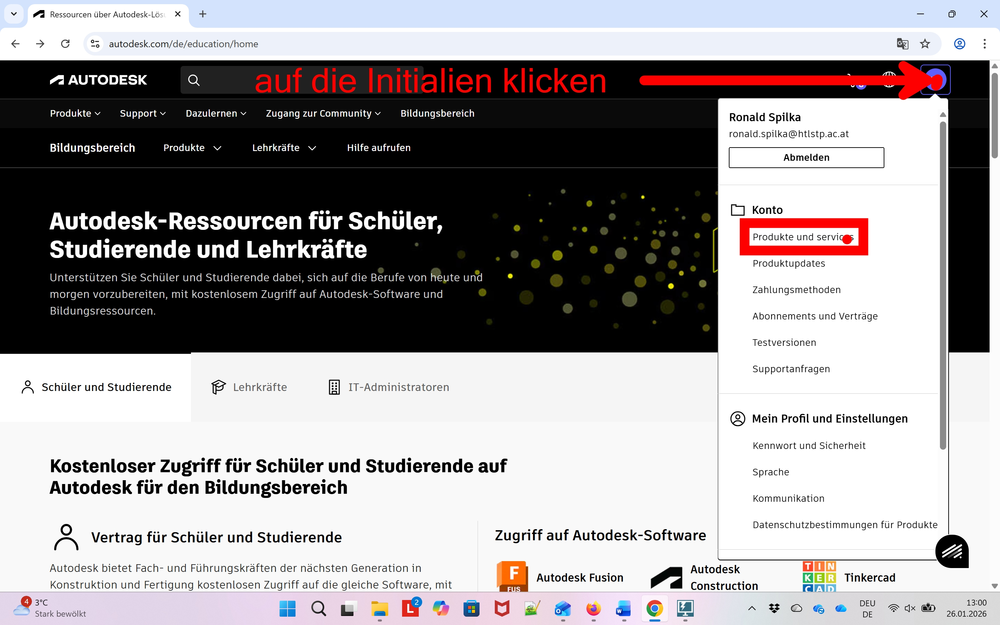
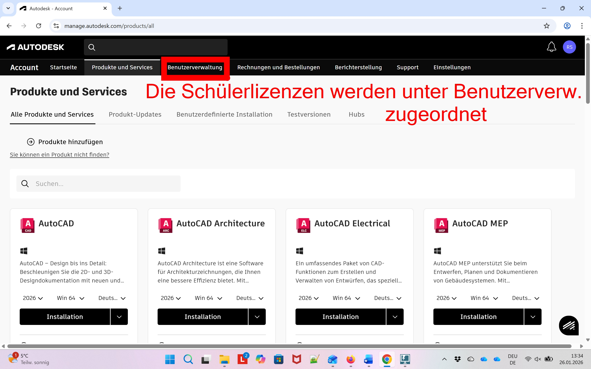
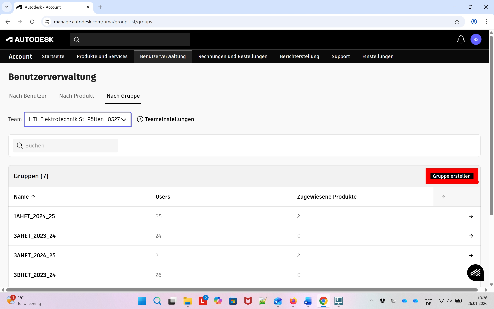
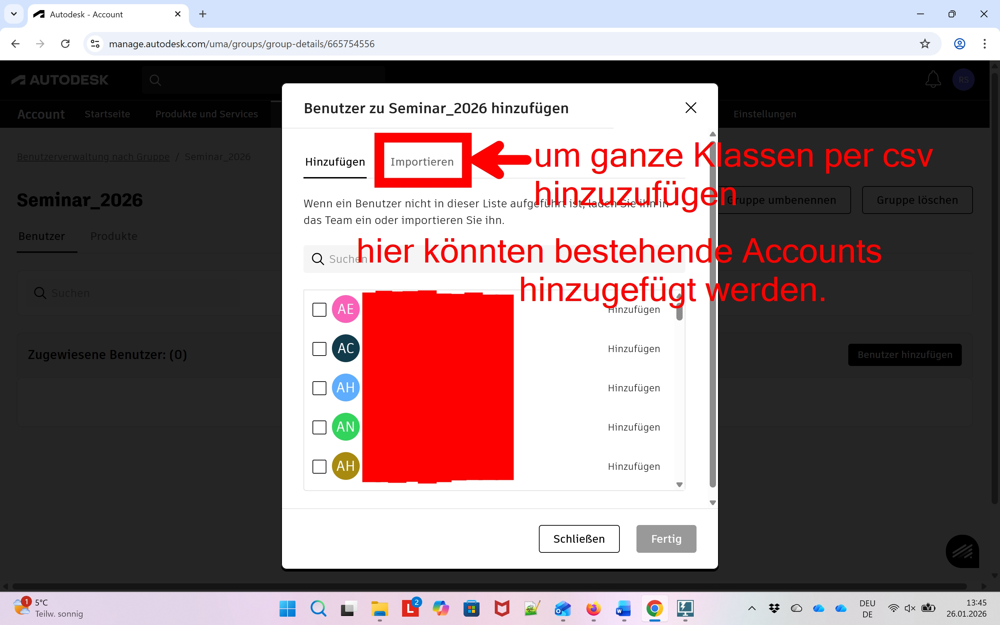
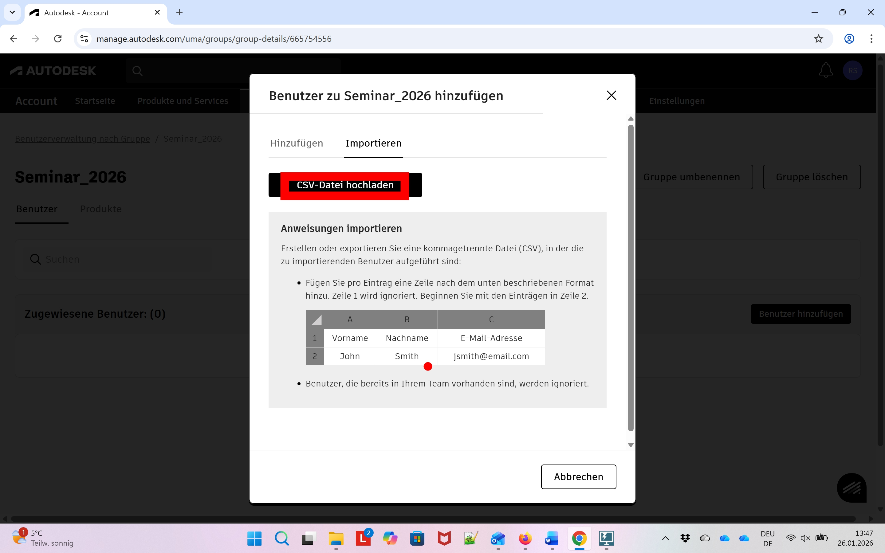
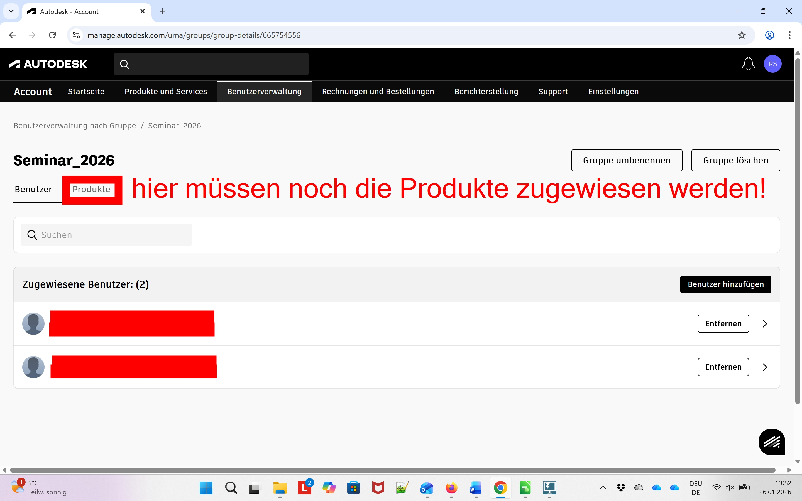
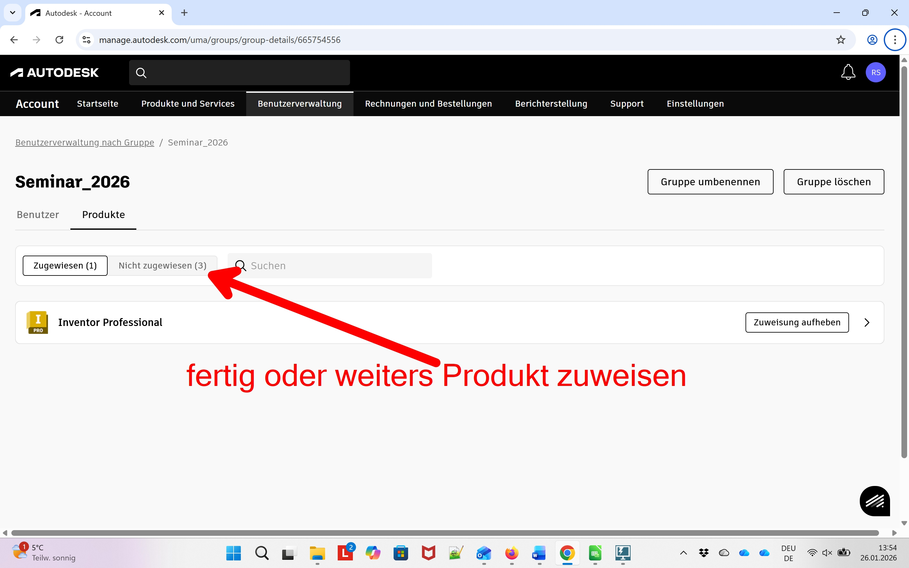

# Zugriff auf Autodeskprodukte (Schülerlizenzen)
In diesem Abschnitt wird gezeigt wie weitere Autodeskprodukte für einen Account freigeschaltet und wie für bereits freigeschaltete Produkte Schülerlizenzen verwaltet werrden können.
* Anmelden bei Autodesk

    
    
    
    
  
* Weitere Produkte und Lizenzen werden über das Profil (rechts oben) verwaltet 

     Produkte verwalten">
    

* Schülerlizenzen zuordnen

    
    
    
    
    
    
    
    
    
    
    

[zurück zur Autodesk-Lehrkraft Seite](../index.md)

