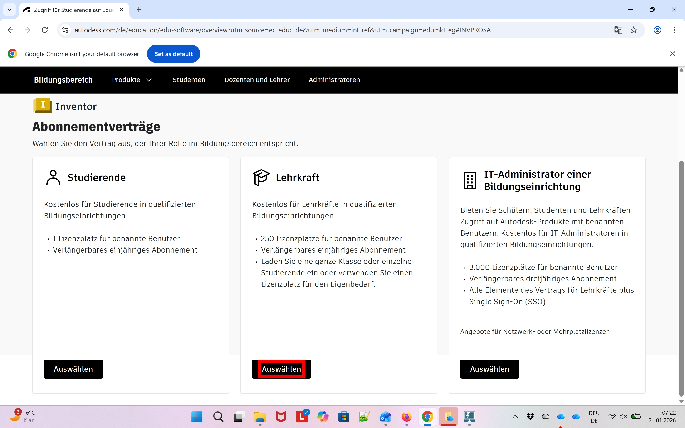
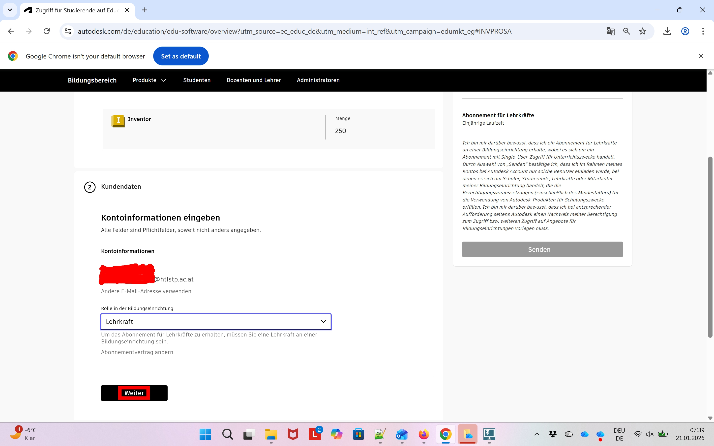
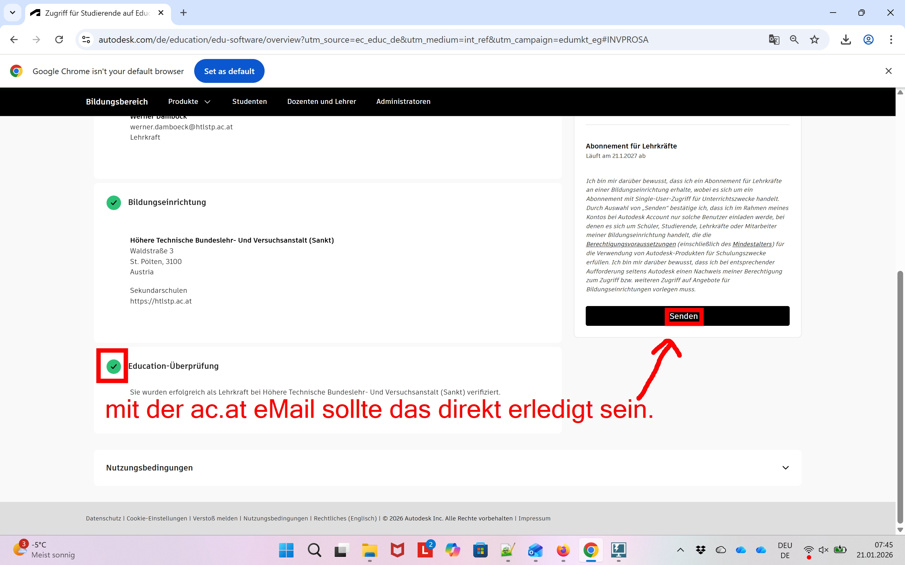
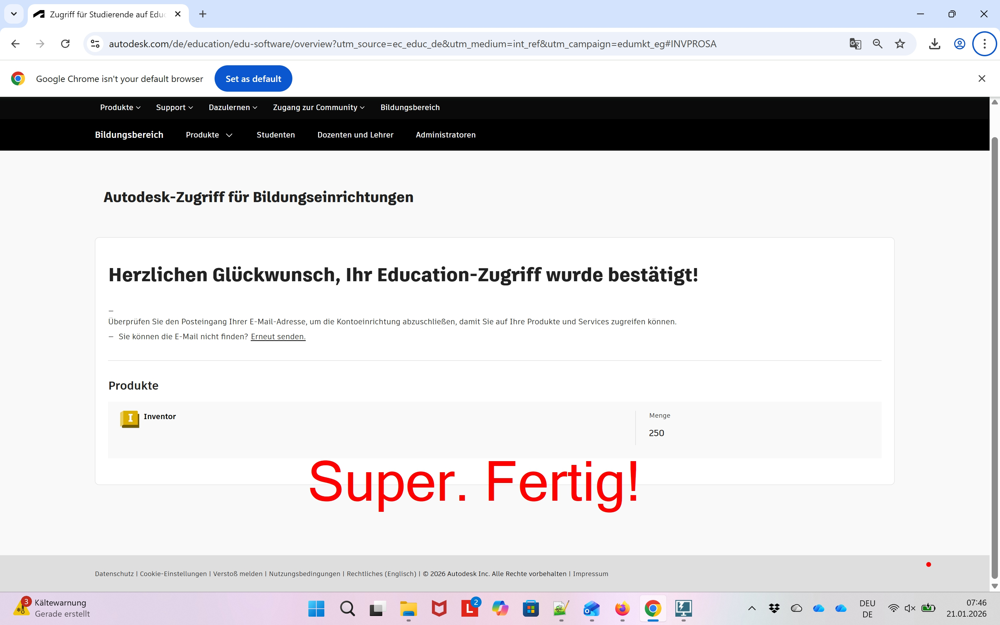

# Autodesk-Registrierung für Lehrkräfte

Die folgenden Bilder zeigen die Schritte, welche notwendig sind, um sich als Lehrkraft der HTBLuVA St. Pölten bei Autodesk zu registrieren.
Da es in letzter Zeit immer wieder zu div. kleineren Problemen mit Firefox,... gekommen ist, empfehle ich bei auftreten von Ungereimtheiten Chrome zu testen. Da manche der unerwünschten Situationen (cvs nicht erkannt, ...) weniger wurden.

Auch sollte während der Registrierung immer wieder das eMail-Postfach abgerufen werden um eventuelle Bestätigungsmails nicht zu übersehen. 
Start der Bilderstrecke ist:
[https://www.autodesk.de/education/home](https://www.autodesk.de/education/home)
Die roten Rechtecke bzw. Markierungen zeigen die Klicks an.

* Anmelden als Lehrkraft
    
    <!--  -->
    

    <!--  -->
    
    
    <!--  -->
    
    
    <!--  -->
    
    
    <!--  -->
    
    
    <!--  -->
    
    
    <!--  -->
    
  
* Wichtig ist hier die Verwendnung der htlstp.ac.at Adresse! 
  Sollte die eMail-Adresse bereits registiert worden sein (möglicherweise bereits vor sehr langer Zeit) kann diese einfach wieder reaktiviert werden. Dazu einfach den Schritten "Passwort vergessen" von Autodesk folgen. Die weiteren Schritte zur Freischaltung - falls notwendig - können danach wieder wie in dieser Anleitung abgeschlossen werden.

  In manchen Fällen muss man sich zum vollständigen Ausfüllen der Kontoinformationen nun neu anmelden (eMail check). Die nächsten vier Bilder zeigen dies, sollte direkt zur Rollenauswahl innerhalb der Bildungseinrichtung gewechselt werden, können diese vier Bilder übersprungen werden. [Springe zu Rollenwahl](#Rollenwahl)
    
    <!--  -->
    
    
    <!--  -->
    
    
    <!--  -->
    

* eMail auf Passcode überprüfen und eingeben!
    
    <!--  -->
    
    
  
* Rollenwahl innerhalb der Bildungseinrichtung:
    
    <!--  -->
    
    
    <!--  -->
    
  
* **ACHTUNG** bei Schulauswahl
    
    <!--  -->
    
    
* **Unsere Bildungseinrichtung wird nur in Sankt anstatt Sankt Pölten geführt! Es gibt zwar auch Bildungseinrichtungen in St.Pölten aber nicht unsere!**
    
    <!--  -->
    
    
    <!--  -->
    
    
    <!--  -->
    

[zurück zur Autodesk-Lehrkraft Seite](../index.md)

