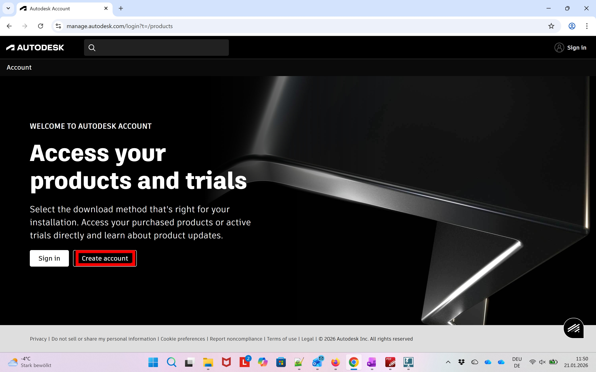
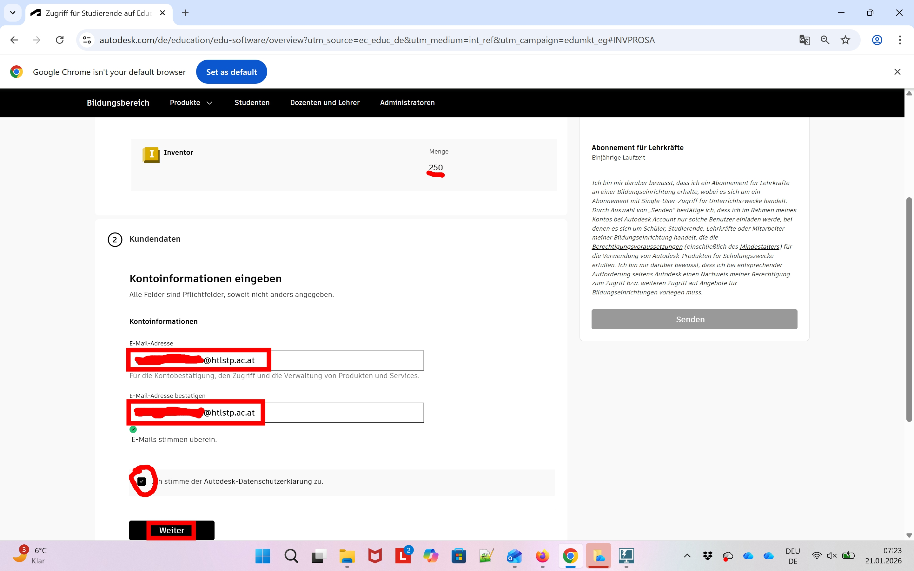
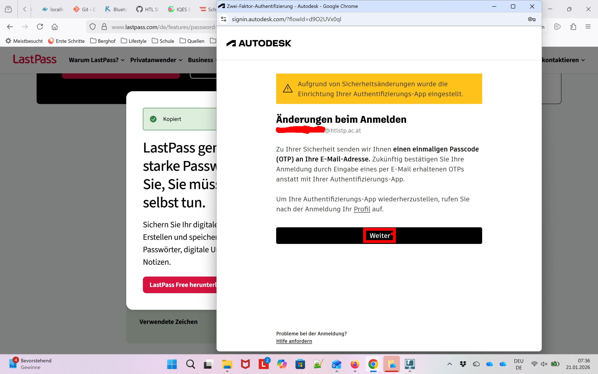
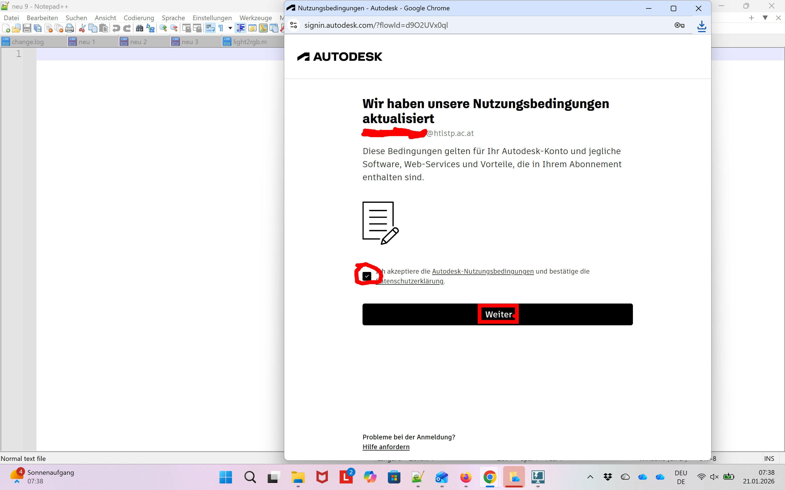
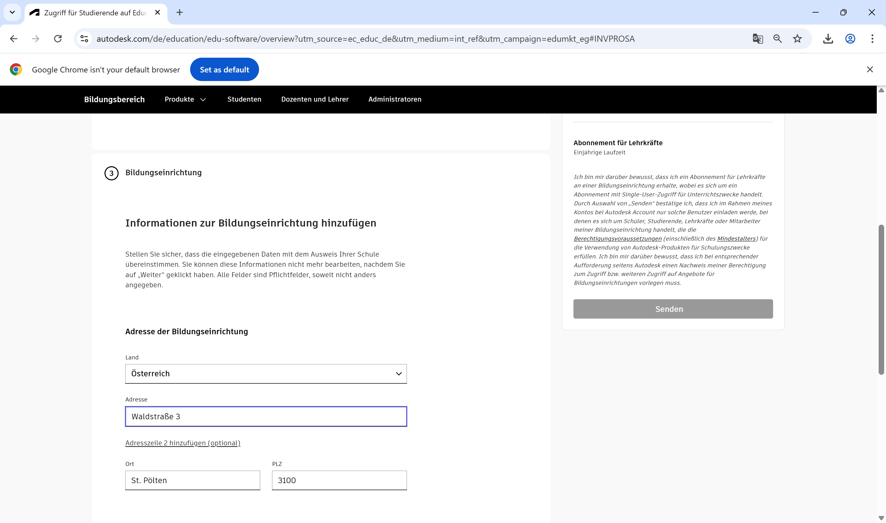
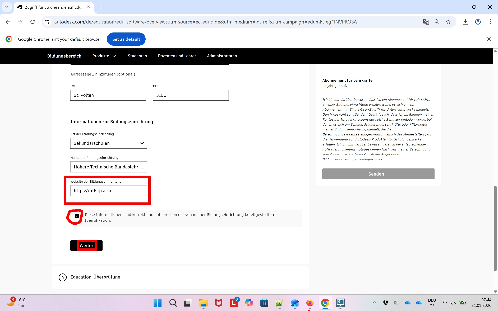

# Lizenz/Registrierung/Installation für Lehrkräfte
## Inhaltsverzeichnis

* [Lizenzmodell](#lizenzmodell)
* [Registrierung](#registrierung-bei-autodesk)
* [Zugriff auf Produkte - Verwaltung von Schülerlizenzen](#zugriff-auf-autodeskprodukte-schülerlizenzen)
* [Installation](#installation)

## Lizenzmodell
Autodesk bietet für einige ihrer Produkte eine Education-Version für SchülerInnen/Studierende/Lehrkräfte an.
Diese kann unter

[https://www.autodesk.de/education/home](https://www.autodesk.de/education/home)

beantragt bzw. heruntergeladen werden.  
Dazu muss ein Konto mit der Schulmailadresse (@htlstp.ac.at) angelegt werden. An diese Adresse wird dann auch die Lizenzinformation gebunden welche im Zuge der Installation bzw. beim ersten Start eingegeben werden muss.

Mit dem Beginn des Schuljahres 2021/22 wurde zudem das Lizenzmodell für Bildungseinrichtungen grundlegend geändert. 
Jede registrierte Lehrkraft kann nun direkt Klassen/Schülern eine Lizenz zuweisen (seit 2025 bis zu 250 je Produkt). 

Zudem wird ab dem Schuljahr 2027 (2026/27 oder 2027/28?) keine Netzwerklizenz für Bildungseinrichtungen angeboten werden! Auf Schulrechnern muss sich dann auch jede Person mit einem persönlichem Account in der Software anmelden.

## Registrierung bei Autodesk
Die folgenden Bilder zeigen die Schritte, welche notwendig sind, um sich als Lehrkraft der HTBLuVA St. Pölten bei Autodesk zu registrieren.
Da es in letzter Zeit immer wieder zu div. kleineren Problemen mit Firefox,... gekommen ist, empfehle ich bei auftreten von Ungereimtheiten Chrome zu testen. Da manche der unerwünschten Situationen (cvs nicht erkannt, ...) weniger wurden.

Auch sollte während der Registrierung immer wieder das eMail-Postfach abgerufen werden um eventuelle Bestätigungsmails nicht zu übersehen. 
Start der Bilderstrecke ist:
[https://www.autodesk.de/education/home](https://www.autodesk.de/education/home)
Die roten Rechtecke bzw. Markierungen zeigen die Klicks an.

<!--  -->

<!--  -->

<!--  -->

<!--  -->

<!--  -->

<!--  -->

<!--  -->

Wichtig ist hier die Verwendnung der htlstp.ac.at Adresse! 
Sollte die eMail-Adresse bereits registiert worden sein (möglicherweise bereits vor sehr langer Zeit) kann diese einfach wieder reaktiviert werden. Dazu einfach den Schritten "Passwort vergessen" von Autodesk folgen. Die weiteren Schritte zur Freischaltung - falls notwendig - können danach wieder wie in dieser Anleitung abgeschlossen werden.

In manchen Fällen muss man sich zum vollständigen Ausfüllen der Kontoinformationen nun neu anmelden (eMail check). Die nächsten vier Bilder zeigen dies, sollte direkt zur Rollenauswahl innerhalb der Bildungseinrichtung gewechselt werden, können diese vier Bilder übersprungen werden. [Springe zu Rollenwahl](#Rollenwahl)

<!--  -->

<!--  -->

<!--  -->

eMail auf Passcode überprüfen und eingeben!

<!--  -->

Rollenwahl innerhalb der Bildungseinrichtung:

<!--  -->

<!--  -->

**ACHTUNG**

<!--  -->

**Unsere Bildungseinrichtung wird nur in Sankt anstatt Sankt Pölten geführt! Es gibt zwar auch Bildungseinrichtungen in St.Pölten aber nicht unsere!**

<!--  -->

<!--  -->

<!--  -->

## Zugriff auf Autodeskprodukte (Schülerlizenzen)
-ToDo-

## Installation
Für die Installation von Autodeskprodukten auf privaten Endgeräten mit Administratorrechten können diese entweder direkt von der Homepage bezogen werden (siehe vorheriger Abschnitt) oder bevorzugt das Installationsfile vom ET-EDV sharepoint verwendet werden. Dies ist auch auf den Schulrechnern installiert und somit sind auch keine Versionsinkompatibilitäten bei Schülern zu befürchten.

[https://htlstp.sharepoint.com/sites/ET-EDV/Software/Autodesk](https://htlstp.sharepoint.com/:f:/r/sites/ET-EDV/Software/Autodesk)

Aktuell ist hier 
* AutoCAD
* Inventor
* Revit

zum Download bereit.
