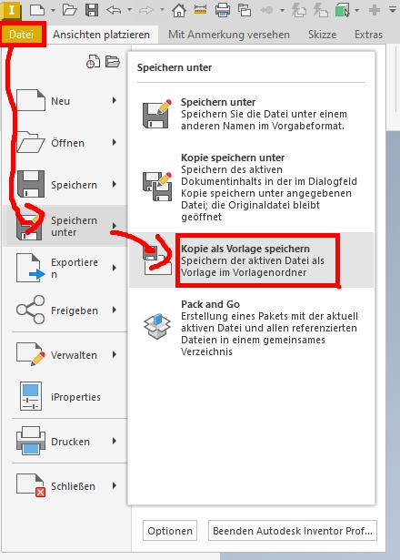
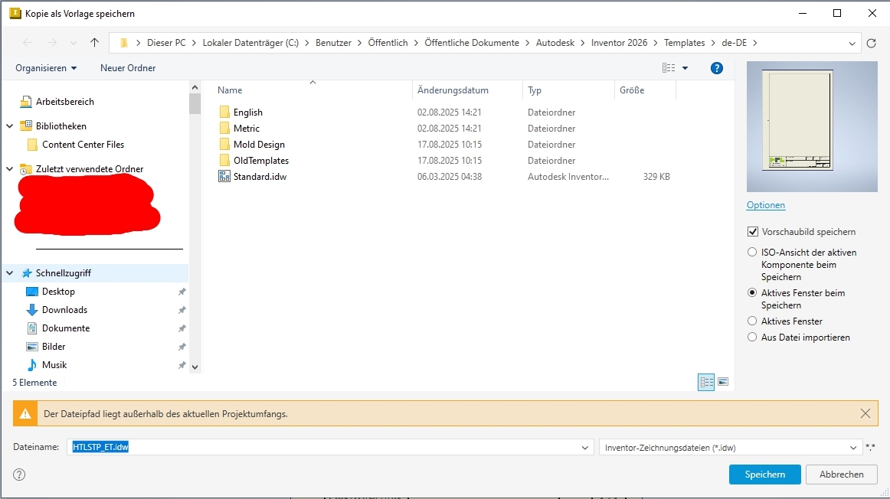
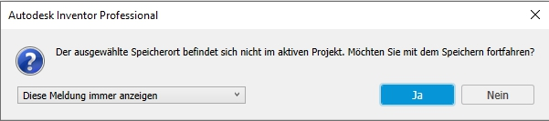
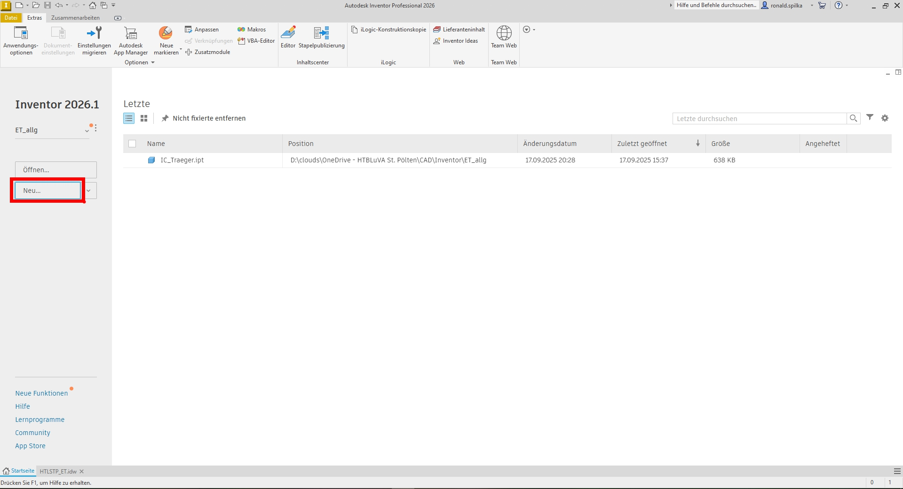
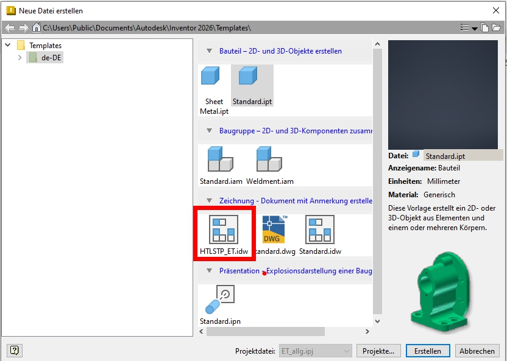
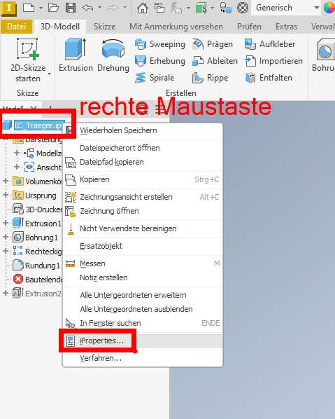
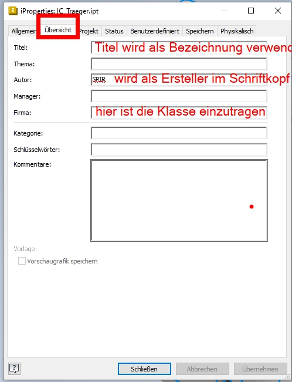
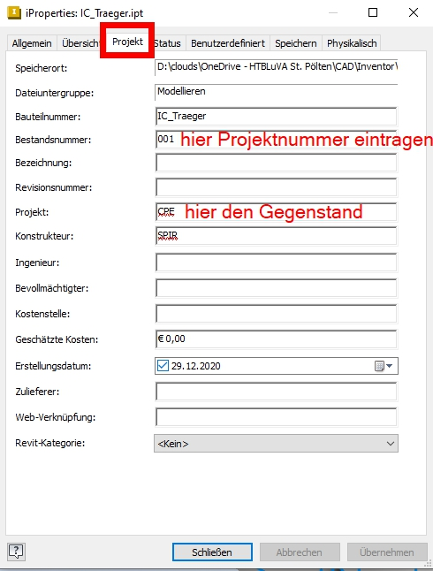
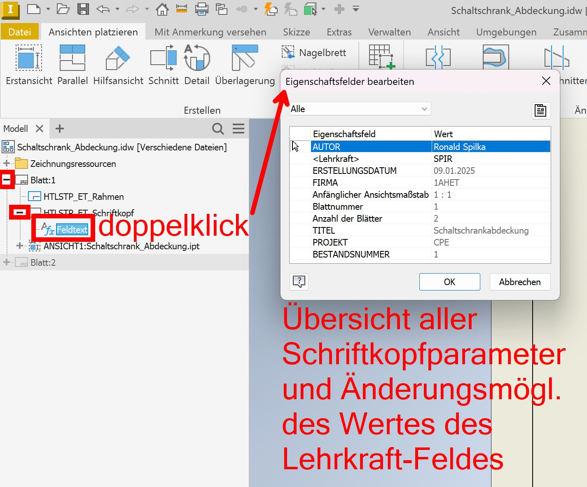

# Vorlage ET-HTLSTP für Autodesk-Inventor Zeichnungsableitung
## Übersicht
* [Download und Einbinden](#download-und-einbinden-der-Inventor-vorlage)
* [Inhalt und Verwendung](#inhalt-und-verwendung-der-vorlage)

[zurück zur allgemeinen Autodesk-Wiki-Site](../index.md)

## Download und Einbinden der Inventor-Zeichnungsvorlage

Ein einfacher Weg die Vorlage als Standardvorlage in Inventor eintragen ist wie folgt:
- Nachdem die [Inventor Vorlage](https://htlstp.sharepoint.com/:u:/r/sites/ET-EDV/ETDocs/Vorlagen/Inventor/HTLSTP_ET.idw "download") (Dateiendung .dwt) heruntergeladen wurde, diese mit einem Doppelklick öffen. Sollte nicht die gewünschte Inventor-Version starten, diese über "Öffen mit..." auswählen.
- In Inventor "Speichern unter -> Kopie als Vorlage speichern" auswählen. Dadurch wird automatisch ein Verzeichnis geöffnet in welchem Inventor Vorlagen sucht.

  

- Nun noch einen sprechenden Namen z.B. HTLSTP_ET.idw vergeben und mit einem Klick auf "Speichern" abschließen.

  

- Die Nachfrage zum speichern ausserhalb des Projektordners kann mit einem Klick auf "Ja" geschlossen werden.

  

- Die noch geöffnete Vorlagendatei kann nun geschlossen werden.
- Beim Erstellen einer neuen Zeichnungsableileitung (z.B. über "Neu..." auf der Startseite)
  
  
  
- steht nun die neue Vorlagendatei z.B. HTLSTP_ET.idw zur Verfügung. Diesen Dialog mit einem Klick auf "Erstellen" beenden.
  
  

- Bevor mit der Zeichnungsableitung gestartet werden kann, erscheint eine Lehrkraft-Abfrage für den Schriftkopf. Hier soll das Kürzel der Lehrkraft eingegeben werden, wo die Zeichnung abgegeben wird. Dies ist der einzige Parameter welcher später nicht über iProperties gesteuert/verändert werden kann!

v

- Nun kann wie gewohnt eine Zeichnungsableitung gemacht werden. Der Schriftkopf wird mit den iProperties-Daten des ersten Bauteils gefüllt (eventuell erst nach erfolgreichem Speichern vollständig).

## Inhalt und Verwendung der Vorlage
Die Vorlage enthält einen automatisierten Schriftkopf und Rahmen für die Blattformate A4 und A3. Größere Blattformate können verwendet werden, aber es werden keine angepassten Falt- und Rastermarken eingefügt.

Die Daten für den Schriftkopf werden aus den iProperties des Bauteils / der Baugruppe bzw. von den aktuellen Parametern der Zeichnungsableitung übernommen.
Folgende Werte werden durch das erstellen Zeichnungsableitung bestimmt:
- Blatt: Gibt automatisch an wie viele Blätter in der Zeichnungsableitung angelegt wurden und in welcher Reihenfolge.
- Maßstab: Wird beim Einfügen einer Erstansicht gewählt und von der ersten Erstansicht in den Schriftkopf übernommen.

### Um die entsprechenden iProperties eines Bauteils / einer Baugruppe zu setzen sind folgende Schritte notwendig:
- Über einen Klick mit der rechten Maustaste auf den Bauteil- bzw. Baugruppennamen kann aus dem Context-Fenster "iProperties ..." gewählt werden.

  

- Im Tab "Übersicht" sind folgende Parameter auszufüllen:
  - Titel: Hauptbezeichnung im Schriftkopf
  - Autor: Ersteller im Schriftkopf
  - Firma: Klasse im Schriftkopf

  

- Aus dem Tab "Projekt" werden folgende Parameter übernommen
  - Bestandsnummer: Projektnummer / Übungsnummer aus dem Unterricht
  - Projekt: Gegenstandsbezeichnung als Kürzel

  

- Ein fertig ausgefüllter Schriftkopf sieht z.B. so aus

  

Eine Übersicht aller Schriftkopf-Parameter, wo auch der Wert für das Lehrkraft-Feld geändert werden kann, bieten die Eigenschaften des Schriftkopf-Feldtextes:

  

[zurück zur allgemeinen Autodesk-Wiki-Site](../index.md)