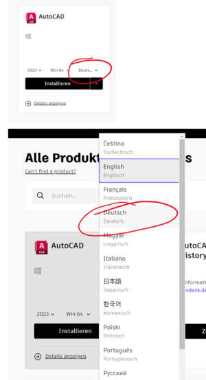

# Autodesk-Produkte in der ET-Abteilung
## Übersicht
* [allgemeines zu Autodesk-Lizenzen](#allgemeines-zu-autodesk-lizenzen)
* [Anleitungen](#anleitungen)
  * [Anleitungen für Schüler](./Autodesk-Schueler/index.md)
  * [Anleitungen für Lehrkräfte](./Autodesk-Lehrer/index.md)
  * [Installation von Autodesk Produkten via Web](#installation-von-autodesk-produkten)
* [Downloads](#downloads)
  * [AutoCad 2026](https://htlstp.sharepoint.com/:f:/r/sites/ET-EDV/Software/Autodesk/AutoCAD%202026%20-%20(DE))
    * [AutoCAD Vorlage](https://htlstp.sharepoint.com/:u:/r/sites/ET-EDV/ETDocs/Vorlagen/AutoCAD/HTLSTP_ET_Vorlage.dwt)
  * [Inventor 2026](https://htlstp.sharepoint.com/:f:/r/sites/ET-EDV/Software/Autodesk/Inventor%20Professional%202026%20-%20(DE))
    * [Inventor Vorlage](https://htlstp.sharepoint.com/:u:/r/sites/ET-EDV/ETDocs/Vorlagen/Inventor/HTLSTP_ET.idw)
  * [Revit 2026](https://htlstp.sharepoint.com/:f:/r/sites/ET-EDV/Software/Autodesk/Revit%202026%20-%20(DE))
* [spezielle Produkt Informationen](#spezielle-produkt-informationen)
  * [Inventor](#inventor)

## allgemeines zu Autodesk-Lizenzen
Autodesk bietet für einige ihrer Produkte eine Education-Version für SchülerInnen/Studierende/Lehrkräfte an.
Diese kann unter

[https://www.autodesk.de/education/home](https://www.autodesk.de/education/home)

heruntergeladen werden.  
Dazu muss ein Konto mit der Schulmailadresse (@htlstp.at bzw. @htlstp.ac.at) angelegt werden. An diese Adresse wird dann auch die 
Lizenzinformation übermittelt welche im Zuge der Installation bzw. beim ersten Start eingegeben werden muss.

Jedem Schüler bzw. jeder Schülerin werden Lizenzen von den Lehrpersonen zugewiesen. Dazu bekomm ihr dann auch ein Email an die Schul-Mailadresse.

Mit dem Beginn des Schuljahres 2021/22 wurde zudem das Lizenzmodell für Bildungseinrichtungen grundlegend geändert. 
Jede registierte Lehrkraft kann nun direkt Klassen/Schülern eine Lizenz zuweisen (seit 2025 bis zu 250 je Produkt)

## Anleitungen
* [Anleitungen für Schüler](./Autodesk-Schueler/index.md)
* [Anleitungen für Lehrkräfte](./Autodesk-Lehrer/index.md)
* [Installation von Autodesk Produkten via Web](#installation-von-autodesk-produkten-via-web)

### Installation von Autodesk Produkten via Web

Website: [https://www.autodesk.de/education/home](https://www.autodesk.de/education/home)
Mit der richtigen Adresse einloggen! 

Klicke nach dem Login auf das User-Symbol rechts oben und dort auf „Produkte und Services“: >

Hier siehst du alle für die freigegebene Produkte, solltest du keine, oder die falschen sehen, dann informiere deinen Lehrer! >

Wähle vor dem Produktdownload die richtige Sprache aus. Das lässt sich nachträglich nicht ändern. >

## Downloads
Die Produktversionen welche auch auf den Schulrechnen installiert sind können direkt über sharepoint heruntergeladen werden:
* [AutoCad 2026](https://htlstp.sharepoint.com/:f:/r/sites/ET-EDV/Software/Autodesk/AutoCAD%202026%20-%20(DE))
* [Inventor 2026](https://htlstp.sharepoint.com/:f:/r/sites/ET-EDV/Software/Autodesk/Inventor%20Professional%202026%20-%20(DE))
* [Revit 2026](https://htlstp.sharepoint.com/:f:/r/sites/ET-EDV/Software/Autodesk/Revit%202026%20-%20(DE))

Zudem gibt es Vorlagen mit entsprechenden Schriftkopf für:
* [AutoCAD Vorlage](https://htlstp.sharepoint.com/:u:/r/sites/ET-EDV/ETDocs/Vorlagen/AutoCAD/HTLSTP_ET_Vorlage.dwt)
* [Inventor Vorlage](https://htlstp.sharepoint.com/:u:/r/sites/ET-EDV/ETDocs/Vorlagen/Inventor/HTLSTP_ET.idw)

## spezielle Produkt Informationen
### Inventor

Inventor ist im Gegensatz zu AutoCAD ein vollständiges 3D-CAD-Programm welches volumenorientiert arbeitet. 
Zudem wird in Inventor automatisch parametrisch gearbeitet. Das heist, wenn eine Bemassung einer Skizze geändert wird, dass 
die Skizze entsprechend geändert wird und in folge auch der 3D-Körper nachgezogen wird bzw. auch alle auf diesen Parameter bezogenen größen. 
Auch kann mit Inventor eine Zusammenstellung mehrer 3D-Objekte erfolgen bzw. eine 2D-Ableitung von 3D-Objekten als Werkstattzeichnung.  

Einen kurzen Einblick gibt das folgene YouTube-Video [YouTube Inventor Skizze](https://www.youtube.com/watch?v=Xtud7LiM1pY)

Zudem bietet Inventor selbst ein sehr gut aufgebautes Tutorial (Lernpfad) für den Selbsteinstieg an um die wesentlichsten Funktionalitäten kennen zu lernen. Dabei wird ein der einfache Umgang von der 2D-Skizze zu 3D-Objekten bis hin zu animierten Baugruppen gezeigt.

Zur Realisierung von 3D-Objekten mittels 3D-Druckern sind [hier](../3D-Druck-allgemein/index.md) einige Informationen zusammengefasst.
