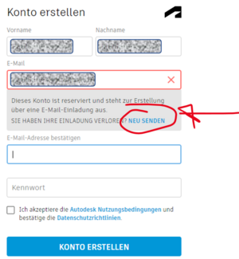
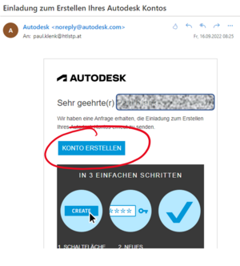
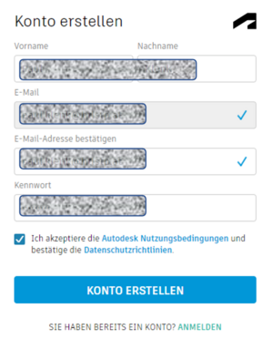
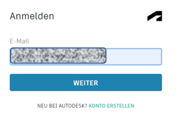
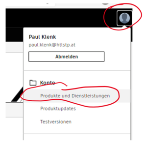
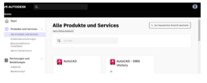
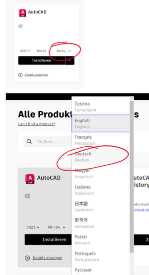

# Lizenz/Installation 
Autodesk bietet für einige ihrer Produkte eine Education-Version für SchülerInnen/Studierende/Lehrkräfte an.
Diese kann unter

[https://www.autodesk.de/education/home](https://www.autodesk.de/education/home)

heruntergeladen werden.  
Dazu muss ein Konto mit der Schulmailadresse (@htlstp.at bzw. @htlstp.ac.at) angelegt werden. An diese Adresse wird dann auch die 
Lizenzinformation übermittelt welche im Zuge der Installation bzw. beim ersten Start eingegeben werden muss.

Jedem Schüler bzw. jeder Schülerin werden Lizenzen von den Lehrpersonen zugewiesen. Dazu bekomm ihr dann auch ein Email an die Schul-Mailadresse.

Mit dem Beginn des Schuljahres 2021/22 wurde zudem das Lizenzmodell für Bildungseinrichtungen grundlegend geändert. 
Jede registierte Lehrkraft kann nun direkt Klassen/Schülern eine Lizenz zuweisen (bis zu 125 je Produkt) 
-> [[Autodesk-Lizenz-Verteilung|Anleitung für Lehrkräfte]].

# Registrierung auf Autodesk via Link in Email 
* Du hast eine Email an deine Schul-Mailadresse erhalten. 
  Klicke auf den Link:  
* Gib die Adresse an, an die die Mail gesendet wurde (entweder Vorname.Nachmale@htlstp.at oder nummer@htlstp.at) 
  Wenn Dort steht, das die Mailadresse schon reserviert ist, dann klicke bitte auf „Neu Senden“. Wenn nicht, gehe weiter zum Punkt 4.  
   
* Gehe zurück zum Mail-Programm und klicke auf den Link der neuen Email:   
* Erstelle jetzt dein Konto (Mit der richtigen Mail-Adresse)   

# Installation von Autodesk Software 

Website: [https://www.autodesk.de/education/home](https://www.autodesk.de/education/home)
Mit der richtigen Adresse einloggen! 

Klicke nach dem Login auf das User-Symbol rechts oben und dort auf „Produkte und Services“: >

Hier siehst du alle für die freigegebene Produkte, solltest du keine, oder die falschen sehen, dann informiere deinen Lehrer! >

Wähle vor dem Produktdownload die richtige Sprache aus. Das lässt sich nachträglich nicht ändern. >

## Inventor

Inventor ist im Gegensatz zu AutoCAD ein vollständiges 3D-CAD-Programm welches volumenorientiert arbeitet. 
Zudem wird in Inventor automatisch parametrisch gearbeitet. Das heist, wenn eine Bemassung einer Skizze geändert wird, dass 
die Skizze entsprechend geändert wird und in folge auch der 3D-Körper nachgezogen wird bzw. auch alle auf diesen Parameter bezogenen größen. 
Auch kann mit Inventor eine Zusammenstellung mehrer 3D-Objekte erfolgen bzw. eine 2D-Ableitung von 3D-Objekten als Werkstattzeichnung.  

Einen kurzen Einblick gibt das folgene YouTube-Video [YouTube Inventor Skizze](https://www.youtube.com/watch?v=Xtud7LiM1pY)

Zudem bietet Inventor selbst ein sehr gut aufgebautes Tutorial (Lernpfad) für den Selbsteinstieg an um die wesentlichsten Funktionalitäten kennen zu lernen. Dabei wird ein der einfache Umgang von der 2D-Skizze zu 3D-Objekten bis hin zu animierten Baugruppen gezeigt.

Die Vorlage eines Zeichnungsblattes mit HTL-Schriftkopf ist im SVN/et-Repository 
svn://letto.htlstp.ac.at/et/cad/inventor/HTL_Zeichnungsblatt_v19.dwg bzw. unter
[Teams-Sharepoint](https://htlstp.sharepoint.com/:u:/t/Autodesk/EUp4QVG1_O1Bqus3BRei4_QByb-bT3gVL_5bVKt9ldSTbQ?e=qxyifu) zufinden.
Inventor-Vorlagen sind in Windows unter **C:\Users\Public\Documents\Autodesk\Inventor 2019\Templates** abgelegt.

Zur Realisierung von 3D-Objekten mittels 3D-Druckern sind [hier](../3D-Druck-allgemein/index.md) einige Informationen zusammengefasst.
