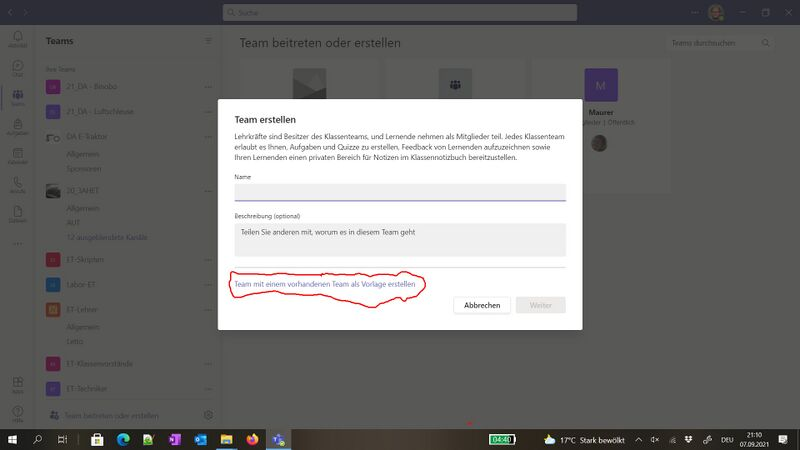
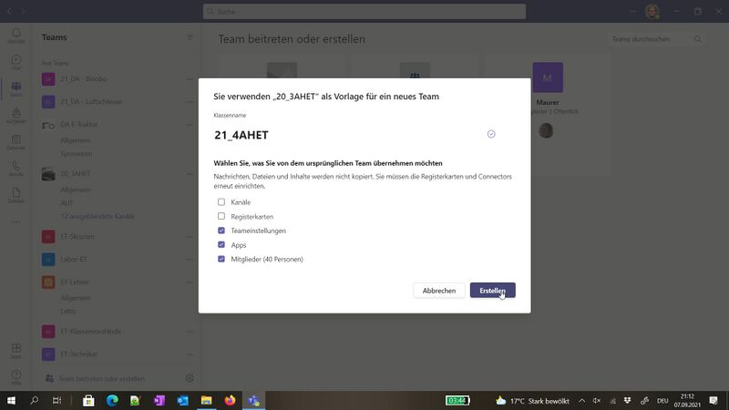

# MS-Teams Team erstellen
Die folgendne Bild zeigen wie man in MS-Teams ein Team erstellt bzw. kopiert. Die ersten Schritte sind dabei ident. 
Beim Kopieren eines Teams kann zudem ausgewählt werden welche Inhalte alle kopiert werden. Somit ist das kopieren von Teams 
eine sehr elegante Methode um von einem allgemeinen Klassenteam ein eigenes Team mit gleichen Schülern zu erhalten ohne 
alle Teilnehmer einzeln Einladen zu müssen. Natürlich kann dies auch zum Anlegen eines Teams aus dem Klassenteam des 
Vorjahres verwendet werden. Der Vorteil dabei gegenüber dem reinen Umbenennen ist, dass auch alle Verknüpfungspunkte 
und Synchronistationsnamen korrekt benannt werden. Beim reinen Umbenennen würde die interne Bezeichnung nicht geändert werden! 

WICHTIG: Die Option kopieren ist aber nur bei Teams möglichen welchen man selbst auch angehört!

Die folgenden Bilder beziehen sich somit auf das kopieren eines bestehenden Teams. Beim Erstellen eines leeren neuen Teams kann 
einfach im 4. Schritt Name und Beschreibung eingetragen werden und hier das Team direkt ertellt werden.

* Auf die Schaltfläche "Team beitreten oder erstellen" klicken (je nach eingestellter Ansicht)     
* Team erstellen auswählen   
* gewünschten Teamtyp auswählen   
* bei neuen Team nun die Felder befüllen und mit "weiter" abschließen, beim Kopieren können die Felder freibleiben (werden durch das kopieren überschrieben!) und unterhalb auf die Option "Team mit einem vorhandenen Team als Vorlage erstellen" anklicken  
* Team welches als Vorlage dienen soll auswählen (es stehen nur Teams zur Auswahl in welchen man selbst eingeschrieben ist!)   
* nun kann der Name des neuen Team eintragen werden und auch die zu kopierenden Inhalte ausgewählt werden      
* im letzten Schritt können noch weitere Lernende oder Lehrende hinzugefügt werden   
* Fertig, es kann bei Bedarf unter "Team verwalten" die Mitglieder (Lernende und Lehrende) angepasst werden, etc ...